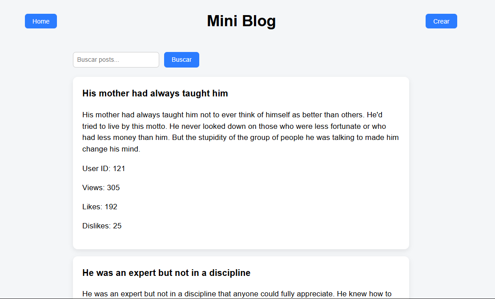
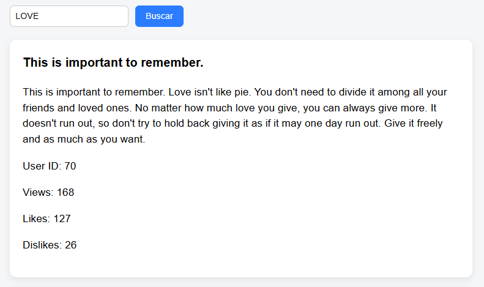
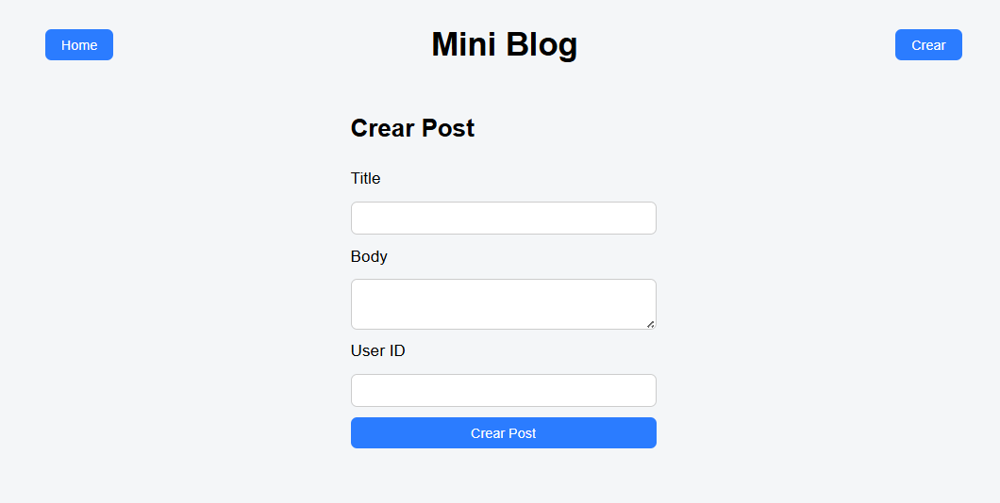

# Laboratorio 5 – Mini Blog (DummyJSON API)

## Descripción

Este laboratorio consiste en desarrollar una **Mini Blog Web Application** utilizando **HTML, CSS y JavaScript puro**, consumiendo la API pública **DummyJSON – Posts**.

---

# Github Pages:


```
https://josekinguvg.github.io/lab5web/HTML/
```


---

# Demo / Video Explicativo

Video demostración del funcionamiento de la aplicación:

```
[PEGAR AQUÍ EL ENLACE DEL VIDEO]
```

---

# Capturas de Pantalla

## Home – Lista de Posts



## Búsqueda de Posts



## Crear Post



---

# Guía de Instalación

### 1. Clonar el repositorio

```
git clone [URL_DEL_REPOSITORIO]
```

### 2. Abrir el proyecto

Abrir la carpeta del proyecto en un editor de código como:

* Visual Studio Code

### 3. Ejecutar la aplicación

Abrir el archivo:

```
html/index.html
```

en el navegador.

También puede utilizarse la extensión **Live Server** en VS Code para ejecutar el proyecto localmente.

---

# Endpoints utilizados

La aplicación consume la API pública:

```
https://dummyjson.com/posts
```

### Obtener posts

```
GET /posts
```

### Buscar posts

```
GET /posts/search?q={texto}
```

### Crear post

```
POST /posts/add
```

---

# Arquitectura del Proyecto

El proyecto está organizado de la siguiente manera:

```
lab5/

html/
  index.html

css/
  styles.css

js/
  main.js
```

### html/

Contiene la estructura principal de la aplicación.

### css/

Contiene los estilos de la interfaz de usuario.

### js/

Contiene la lógica de la aplicación:

* consumo de API
* manipulación del DOM
* manejo de eventos
* renderizado de posts
* UI states

---

# Funcionalidades Implementadas

✔ Listado de posts desde la API
✔ Búsqueda de posts por texto
✔ Creación de posts mediante formulario
✔ Visualización del post creado por el usuario
✔ Manejo de estados de interfaz:

* idle
* loading
* success
* empty
* error

✔ Interfaz con diseño tipo **card layout**

---

# Tecnologías Utilizadas

* HTML5
* CSS3
* JavaScript (Vanilla JS)
* Fetch API
* DummyJSON REST API

---

# Autor

Nombre: José Rivera

Curso: Sistemas y Tecnologías Web
Universidad del Valle de Guatemala
